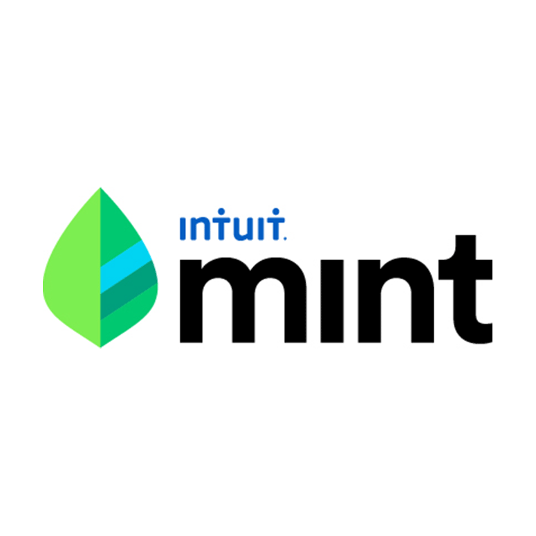
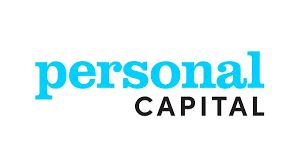
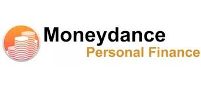
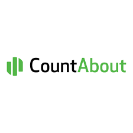

# Mint Case Study

## Overview and Origin

The name of the application in this study case is Mint App, it's legal name is Mint Software Inc. Mint was founded in 2006. The founder of the company is Aaron Patzer.

While attending school in his late teens, Aaron Patzer was commingling his business and personal finances. Roughly spending around an hour, each sunday per week using tools such as Quicken and Microsoft money to reconcile his expenses. The idea of mint came about after he forgot to update his finances for 5 months due to school and an excess of work. He didn't open Quicken to update anything, when he finally got to his task, he had over 500 uncategorized transactions to deal with. Inspired by his dreadful task, Aaron Patzer wanted to make a tool that would help people reconcile their finances in minutes. Mint was then born. He wanted to create something that was easy to use, efficient, that would help people make better money decisions.

When it comes to funding, Mint has raised $31.8M in funding over 5 rounds. According to Crunchbase.com, the last funding was on Aug. 12, 2009. Mint has 15 investors.

* During the Seed Round on Oct 1, 2006, they fundraised $325k with 1 investor.
* During the Angel Round on Nov 2, 2006, they fundraised $750k with 5 investors.
* During the Series A, on Oct 16, 2007, they fundraised $4.7M with 8 investors.
* During the Series B, on Mar 5, 2008, they fundraised $12M with 6 investors.
* During the Series C, on Aug 12, 2009, they fundraised $14M with 6 investors.

Mint was then acquired by Intuit on September 14, 2009 for $170M. 

## Business Activities:

The financial problem the company is trying to solve is financial awareness, financial literacy, and to save time for people that don't have it. The founder wanted to create a company that could help people reconcile their bank statements in minutes. An application that would be easy to understand, something that would track personal finances and also provide advice on how to save money. Help people find good deals such as when is the best time to refinance mortgages and/or student loans. The app was also designed to help the consumer answer questions such as where is my money going, and where do I need to budget better?

According to the company's first strategy plan created by Noah Kagan, the company's intended customers were young professionals, people in debt and new families. Some of those new families really targeted mothers, who are always finding ways to save. 
Mint's market target has changed throughout the years. Market size has changed due to market strategy and goal setting as discussed in Noah Kagan's blog. Some of the tactics first utilized at the beginning, focused on it's market target through personal finance bloggers and tech professionals. Mint App has reached 20 million downloads. According to SimilarWeb, the majority (92.56%) of Mint's customers are located in the US.

Mint App offers their services for free instead of most of their competitors who have fees. Free TransUnion credit scores have given Mint a competitive advantage over the competitors who offer free services. It's also interesting to note that there is a huge amount of blogs that talk about alternatives to Mint.

When it comes to the technology mint uses, Crunchbase mentions that Mint uses 60 technology products (ex. HTML5, Google Analytics, & jQuery). It's website alone is utilizing 41 technologies including SPF, Google Font API, and WordPress. Websites such as Stackshare on the other hand, showcase that Mint utilizes the following technologies:
* Application and Data: PHP, NGINX, Boostrap, Amazon CloudFront
* Utilities: Mixpanel and ClickTale
* DevOps: New Relic, Vanish, Salt and AlertBot
* Business Tools: Jira, Drupal and Get Satisfaction

## Landscape:

Mint is in the Personal Finance domain. It's also considered to be part of the free money management app.

In the last 5-10 years, the personal finance app domain has helped individuals manage their finances better and these apps have eliminated complex accounting systems to manage earnings and expenses. Those written accounting ledgers are gone and the digital age has allowed everything to be accessed through our phones/computers within minutes. No need for a pen or a pencil, or manual data entry anywhere. Advanced personal finance apps save time by fetching information from bank accounts, savings accounts, loan services just to name a few, all within one app. Using sophisticated technologies to analyze patterns and categorize transactions all within a click of our fingers. According to Customerthink, 63% of smartphone users have at least one personal finance app, 2/3 of American smartphone users use a personal finance app, and the website states that Statistica transaction value in the personal finance sector will reach $10M by the end of the year.

When it comes to the Personal Finance domain, Mint's competitors include:

   1) Personal Capital
   2) Tiller
   3) YNAB (You Need A Budget)
   4) Quicken
   5) Banktivity
   6) Every Dollar
   7) Moneydance
   8) PocketSmith
   9) CountAbout
   10) Status

<html>
 

  

    
  

 

  

    
  

 

  

    
  

 

  

    
  

 

  

    
  

 

  

    
  

 

  

    
  

 

  

    
  

 

  

    
  

 

  

    
  

</html>

## Results

Mint is one of the most popular personal finance budgeting apps having over 20 million users as of November 2020 compared to its competitors.

Some of the metrics used to compare companies in this domain include yearly/monthly fees, customer service, investment tracking, credit score monitoring, budgeting categorization & limits, education learning tools such as wealth management tools, and synchronization.Based on the metrics mentioned, Mint does a good job on most of metrics but has lacked on customer service and synchronization not allowing the app to be the best one around.

According to Investopedia.com, the best overall budgeting app is You Need a Budget (YNAB) due to the company's philosophy and reputation. This app is costly at $87 a year. Mint is the second budget app mentioned in the article as being the Best Free Budgeting App. You pay nothing compared to You Need a Budget (YNAB) app yet most of the cons from mint mention the issues the company is having with customer service and synchronization. If the company didn't have these issues, it would probably be the best budgeting app available.

## Recommendations

If i was to advise the company, i would suggest finding better ways to improve their customer service platform. Adding additional bots. Find ways to get rid of complaints, maybe utilizing AI to help answer questions on the website.

I would also suggest the company add a system that allows the customer to be more strict with their budgets. This can include having additional alerts when someone will reach their budgets.There's companies such as Pocket Guard who are helping their customers with overspending and helping them take a grip of their spending habits.

Also adding a section for goal setting. Imagine if someone wants to save $1k within a specific time frame. The company can put a section of goal setting and help the customer by giving them tips on how to better achieve their goals. It doesn't have to be harsh tips or judgemental tips but an example of this can be "Make automated savings deposit of $$ amount per week to reach your goal by this day.". Another example can be, "You received an additional amount of money this week of $50. Save it to reach your goal faster!"

Offering better customer service could make the app better as this tends to be one of the things the customer's complain the most. Fixing this issue can only help the app.  Adding a savings goal section, or implementing stricter budgeting tools could help customers obtain their goals faster. There is a lot of research that proves that our habits help us or break us. The company can benefit from helping the customer to achieve their goals and in return they will become more popular, it's a domino effect.

These additional products would need more technology within AI and ML. To create algorithms that take the customers input to help them achieve their goals.
These technologies are appropriate for this solution because they make things more efficient. AI can help predict the best decision to make. For example Alexa, utilizes AI to come up with the answers. In order for these new services to be included in the app, there has to be a model of what is a good and bad answer. As more data is inputted, the more accurate the model.

## References

* [Crunchbase Mint information](https://www.crunchbase.com/organization/haveamint)
* [Aaron Patzer: The Minting of Mint.com- Youtube](https://www.youtube.com/watch?v=Fc8u5z7ys40)
* [Mint-alternatives -Competitors](https://www.softwaretestinghelp.com/mint-alternatives/)
* [Mint Review 2020](https://investorjunkie.com/reviews/mint-com/)
* [Investopedia - Best Personal Apps 2020](https://www.investopedia.com/best-budgeting-apps-5085405)
* [Mint vs YNAB](https://investorjunkie.com/compare/mint-vs-ynab/)
* [Mint Analytics](https://www.similarweb.com/website/mint.com/)
* [First strategy plan](http://thekazushi.com/wp-content/uploads/2012/10/Mint_Marketing_Plan-2.pdf?utm_campaign=Submission&utm_medium=Community&utm_source=GrowthHackers.com)

* [Noah Kagan's Blog](https://okdork.com/quant-based-marketing-for-pre-launch-start-ups/)
* [Stackshare Mint](https://stackshare.io/mint/mint)
* [Customerthink](https://customerthink.com/personal-finance-app-development-stats-features-types-and-cost/)
---